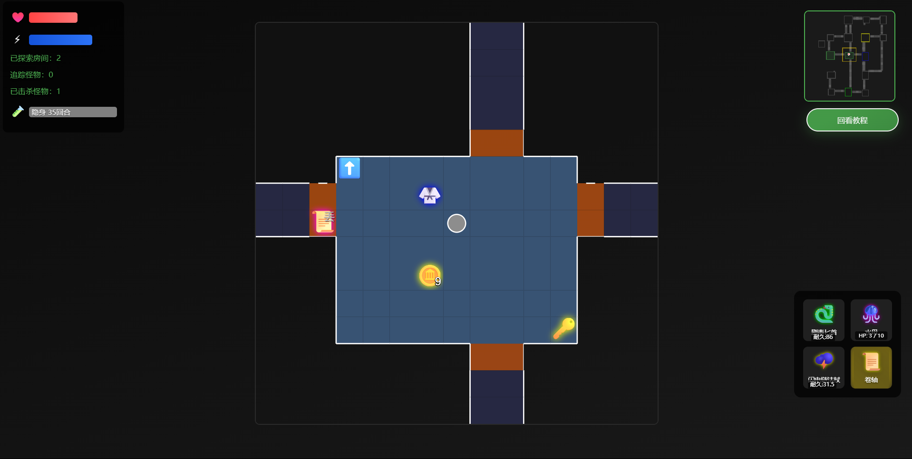

# Chinese Dungeon

A browser-based dungeon adventure game. Immerse yourself in a stylized dungeon experience with beautiful UI, interactive controls, and engaging gameplay—all written in HTML, CSS, and JavaScript.



## Features

- **Modern UI:** Stylish menus, animated transitions, and responsive design.
- **Dungeon Gameplay:** Explore dungeon levels, fight monsters, collect items, and survive!
- **Inventory System:** Manage your items and equipment with an interactive inventory popup.
- **HUD:** Real-time health, power, and status indicators.
- **Touch & Keyboard Controls:** Play on desktop or mobile with on-screen buttons.
- **Visual Effects:** Animated health bars, damage feedback, and death screens.
- **Chinese & English UI:** Interface supports both Chinese and English text.

## Getting Started

1. **Clone the repository:**
    ```bash
    git clone https://github.com/SUSTechHSAS/Chinese-Dungeon.git
    ```
2. **Open the game:**
    - Simply open `ChineseDungeon.html` in your web browser.

> No installation or build step required—just open and play!

## Emoji
[AppleColorEmoji](https://github.com/GORAlexComp/AppleColorEmojiFont/releases/download/v1/AppleColorEmoji.woff)

## Controls

- **Arrow Keys / WASD / On-screen Buttons:** Move your character.
- **Inventory Button:** Open/close your inventory.
- **Interact:** Click or tap on items, monsters, or menu options.

## File Structure

```
Chinese-Dungeon/
│
├── ChineseDungeon.html      # Main game file (HTML, CSS, JS)
├── assets/                  # (Optional) Images, icons, and screenshots
└── README.md                # Project documentation
```

## Contributing

Pull requests and suggestions are welcome!  
If you find bugs or have feature requests, please open an issue.

## License

[GPL-3.0](LICENSE)  
© SUSTechHSAS
